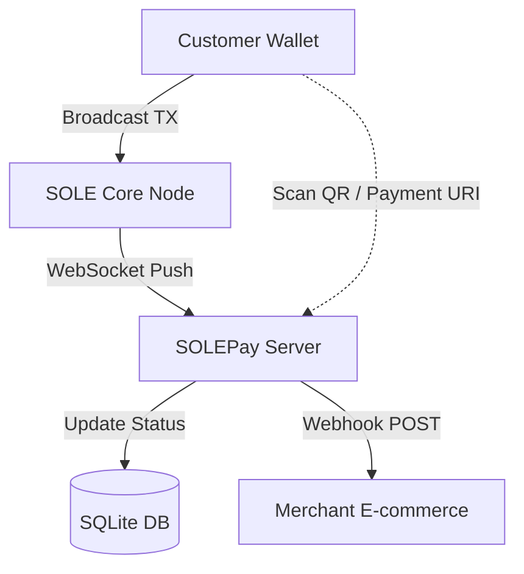

# 🔆 SOLEPay Server

[](https://www.python.org/)
[](https://opensource.org/licenses/MIT)
[]()

SOLEPay is an open-source, non-custodial cryptocurrency payment gateway designed specifically for the [SOLE](https://github.com/nicolocarcagni/sole) Blockchain. It provides a lightweight and secure bridge for merchants to accept SOLE payments with real-time confirmation and automated webhook notifications.

## Features

*   **Non-Custodial:** Funds are sent directly to the merchant's SOLE wallet. SOLEPay never touches your private keys.
*   **Real-Time Monitoring:** Uses WebSockets to listen to the SOLE Node's mempool for instant transaction detection.
*   **API Key Secured:** Multi-merchant support with unique API keys for secure invoice creation.
*   **Webhooks:** Notifies your e-commerce platform immediately when a payment is confirmed.

Built using FastAPI and SQLite for maximum performance and easy deployment.

## Architecture

SOLEPay acts as a middle-layer between the SOLE blockchain and your store.



1.  **Customer Wallet** scans the URI generated by SOLEPay and broadcasts a transaction.
2.  **SOLE Core Node** receives the transaction and pushes it to SOLEPay via a WebSocket.
3.  **SOLEPay Server** matches the transaction memo with an active invoice.
4.  **Instant Update:** The checkout UI turns yellow, and a **Webhook** is dispatched to the merchant.

## Manual Setup

```bash
# 1. Create a virtual environment
python -m venv venv
source venv/bin/activate

# 2. Install dependencies
pip install -r requirements.txt

# 3. Create your first merchant
# This will generate an API Key (X-API-Key)
python new-merchant.py --name "Community Library" --wallet "1NXVc9JY9eVerzeqcvatMgHkrDYAJc2ec4"

# 4. Run the server
uvicorn main:app --reload --host 0.0.0.0 --port 8000
```

## API Usage Example

Create a new invoice via the REST API:

```bash
curl -X POST http://localhost:8000/api/invoices \
  -H "Content-Type: application/json" \
  -H "X-API-Key: your_sole_live_api_key_here" \
  -d '{
    "amount": 1.5,
    "webhook_url": "https://yourshop.com/api/webhook"
  }'
```

**Response:**
```json
{
  "id": "550e8400-e29b-41d4-a716-446655440000",
  "amount": 1.5,
  "memo": "INV-A1B2C3D4E5F6",
  "status": "PENDING",
  "uri": "sole:1NXVc9JY9eVerzeqcvatMgHkrDYAJc2ec4?amount=1.5&memo=INV-A1B2C3D4E5F6"
}
```

## Acknowledgments

*Some parts of the frontend and this README.md were generated with the assistance of AI.*

## License

This project is licensed under the **MIT License**. See the [LICENSE](LICENSE) file for details.